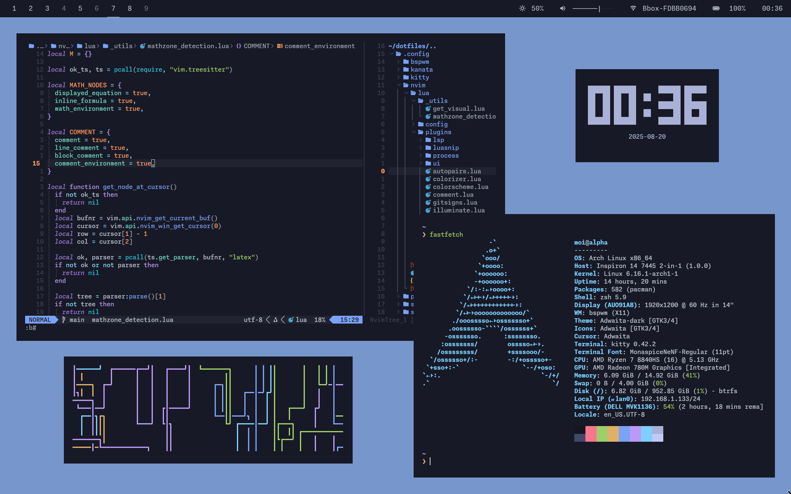

# My Arch Linux Configuration



## Installation

In the live system

```bash
loadkeys fr
iwctl
```

then

```iwctl
station wlan0 scan
station wlan0 get-networks
station wlan0 connect SSID
```

Exit iwctl and run `archinstall`. Install the **bspwm** profile with the **lightdm** greeter.

## Remove the greeter

```zsh
sudo systemctl disable lightdm
sudo pacman -Runs lightdm-gtk-greeter
```

## Config Files

```zsh
cd
sudo pacman -S git stow
git clone https://github.com/3fxcf9/dotfiles
stow dotfiles
```

Among others, the `.xinitrc` file will get linked in the home.

## Packages

Install paru
```zsh
sudo pacman -S --needed base-devel
git clone https://aur.archlinux.org/paru.git
cd paru
makepkg -si
```

Bspwm

```zsh
sudo pacman -S bspwm sxhkd xorg-xinput xorg-xsetroot polybar maim xclip xdotool
mkdir ~/Screenshots
```

Fix polybar backlight

```zsh
sudo chown $USER /sys/class/backlight/amdgpu_bl1/brightness
```

Fonts

```zsh
sudo pacman -S otf-monaspace-nerd
```

Applications

```zsh
sudo pacman -S kitty firefox btop neovim signal-desktop yazi zathura zathura-pdf-mupdf
```

Utils

```zsh
sudo pacman -S pavucontrol man-db unzip bat fd rg fastfetch cpufetch zoxide udisks2 jq
```

Zsh

```zsh
sudo pacman -S zsh zsh-autosuggestions zsh-syntax-highlighting eza fzf
paru -S pursarship    # Shell
chsh -s $(which zsh)

############## Reboot if needed ##############
```

Kanata

```zsh
paru kanata

# Permissions
sudo groupadd uinput
sudo usermod -aG input $USER
sudo usermod -aG uinput $USER
sudo echo 'KERNEL=="uinput", MODE="0660", GROUP="uinput", OPTIONS+="static_node=uinput"' > /etc/udev/rules.d/99-input.rules
sudo udevadm control --reload && udevadm trigger --verbose --sysname-match=uniput
sudo modprobe uinput

############## Reboot if needed ##############

systemctl --user enable kanata.service
systemctl --user start kanata.service

# Re-run bspwm config file
```

Git and github

```
sudo pacman -S github-cli git-delta
gh auth login

# Generate signing key
gpg --gen-key
gpg --list-secret-keys --keyid-format LONG
```

## Dev

```zsh
paru -S vlang nodejs npm tree-sitter tree-sitter-cli
```

OCaml

```zsh
sudo pacman -S opam
opam init -y
opam install odoc utop  # ocaml-lsp and ocamlformat are managed by Mason
```

3D printing

```zsh
sudo pacman -S prusa-slicer
```

School

```zsh
sudo pacman -S inkscape python3 python-pip python-xlib rofi
sudo pacman -S texlive-basic texlive-latex texlive-latexrecommended texlive-fontsrecommended texlive-mathscience texlive-latexextra pdf2svg
# TODO: Add course_manager setup
```

### Course manager

Add built binaries to `~/.local/bin`.
